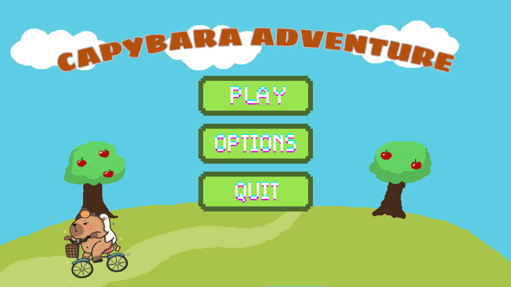
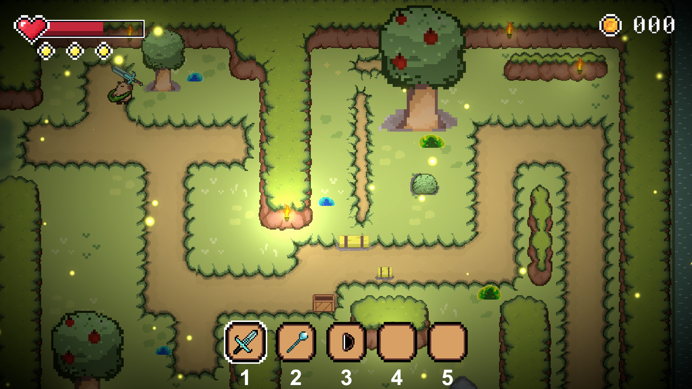
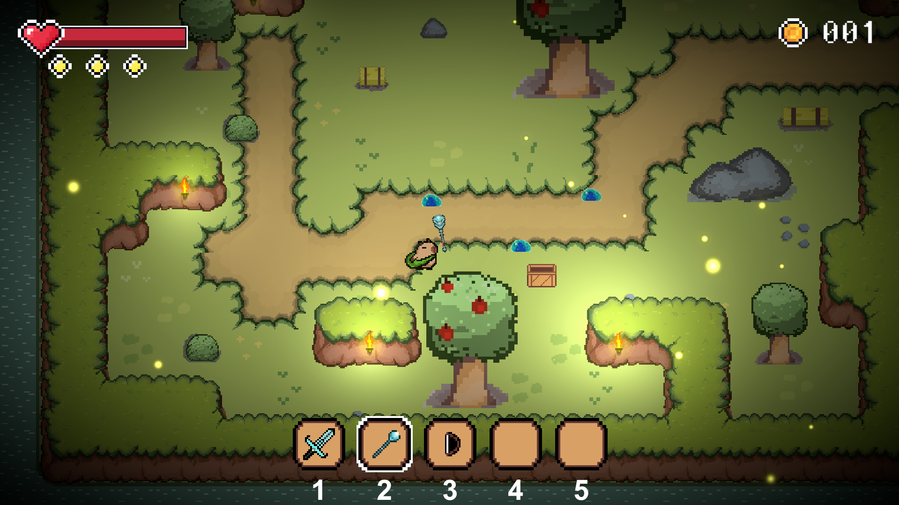
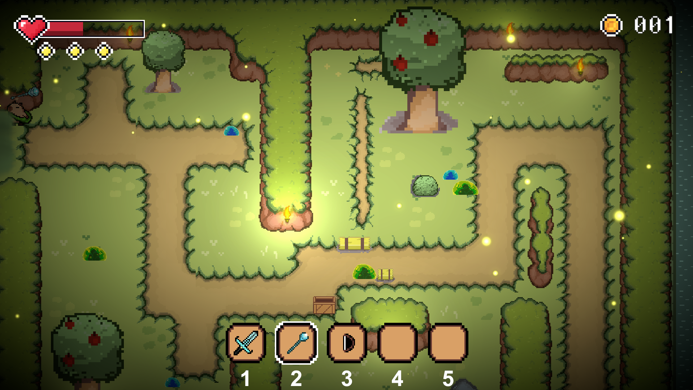
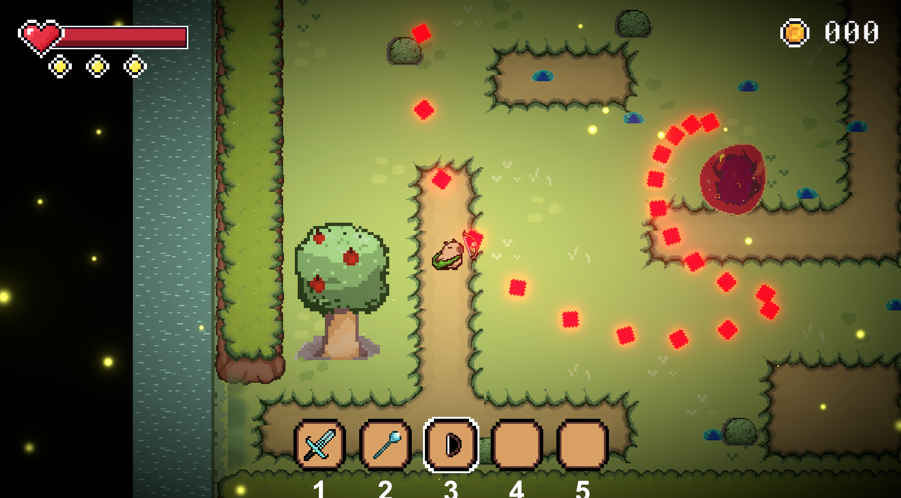

#  Capybara Game

##  Giới thiệu
Capybara Game là một trò chơi web đơn giản, mang tính giải trí nhanh, nơi người chơi cần tương tác (click) để bắt các chú capybara trong thời gian giới hạn. Trò chơi hướng đến trải nghiệm nhẹ nhàng, vui nhộn, phù hợp để thư giãn trong thời gian ngắn. 
Ý tưởng của game thuộc dạng mini browser game, tập trung vào phản xạ và tốc độ của người chơi.

##  Demo hoạt động & Giao diện

Dưới đây là một số hình ảnh minh họa cho trò chơi:

*(Giao diện chính của trò chơi)*

*(Các khu vực bản đồ)*

*(Giao diện Boss)*

**Cách thức hoạt động:**
- Người chơi truy cập vào giao diện game trực tiếp trên trình duyệt.
- **Khi trò chơi bắt đầu:** Các chú Capybara sẽ xuất hiện một cách ngẫu nhiên trên màn hình.
- **Thao tác chơi:** Người chơi click vào capybara để ghi điểm. Mỗi lần click đúng, điểm số của bạn sẽ tăng lên.
- **Kết thúc game:** Trò chơi sẽ tự động kết thúc khi hết thời gian. Hệ thống sau đó sẽ hiển thị tổng điểm mà người chơi đạt được.

##  Mục tiêu
Đạt điểm cao nhất có thể trong thời gian ngắn nhất.

## Công nghệ sử dụng
- **Frontend:** HTML, CSS, JavaScript.
- Có thể sử dụng các framework như Next.js (tuỳ thuộc vào version của project).
- Trò chơi chạy trực tiếp trên trình duyệt mà không cần phải cài đặt.
- Game được xây dựng tối ưu để load nhanh, dễ dàng deploy (trên các nền tảng như Vercel, Netlify) nhằm tối ưu trải nghiệm người dùng.

## Điểm nổi bật
- Gameplay cực kỳ đơn giản, dễ tiếp cận.
- Không yêu cầu đăng nhập, người dùng có thể chơi ngay lập tức.
- Rất phù hợp để làm project demo frontend hoặc luyện tập logic game cơ bản.
- **Khả năng mở rộng:** Có thể phát triển thêm các tính năng như Leaderboard (bảng xếp hạng), chia Level tăng dần độ khó, hoặc bổ sung thêm Animation & Sound cho sinh động
